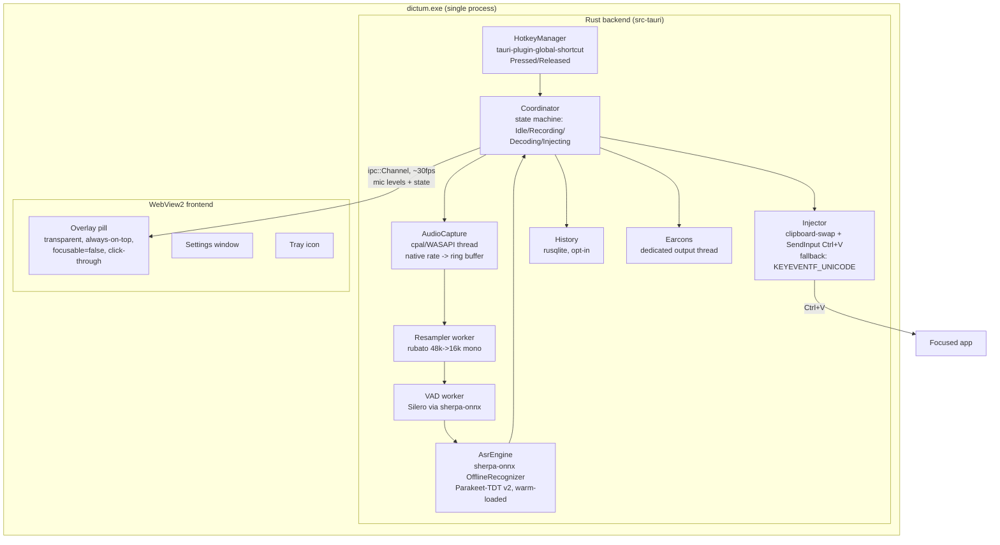

# PLAN.md — Dictum

**A local, CPU-only, push-to-talk dictation app for Windows.** Hold a hotkey anywhere, speak, release — transcribed text appears in the focused app in under a second. Fully local processing, no telemetry, verifiable.

**A personal tool first**, developed as an open-source project. Coworkers (or anyone) adopting it is welcome but incidental — enterprise deployment (Intune, machine config, egress lockdown) is supported via optional docs in `packaging/`, never the default path and never milestone-gating.

---

## 1. Vision & Non-Negotiables

### Vision
SuperWhisper's core loop, on Windows, fully local: hold hotkey → speak → release → text lands at the cursor. No cloud, no telemetry, no account. The app that "just works" out of the box (zero-config first run is SuperWhisper's #1 complaint and Wispr Flow's ~800 MB Electron idle is the second attack vector — a lean Tauri/Rust app with measured <1s local latency wins both axes).

### Non-negotiables
1. **Latency:** key-release → text-in-app **< 1000 ms** for utterances ≤ 15 s on target laptop hardware (i5/i7 corporate class, on battery).
2. **Local-first, zero egress in use:** the dictation pipeline makes **zero** network calls — no updater, no telemetry; audio and text never leave the machine (verifiable via Sysmon Event ID 3 + firewall rule). The only network code is the explicit, user-triggered one-time model download (SHA256-verified); a fully offline sideload path exists for air-gapped or locked-down setups.
3. **No lost first words:** mic must capture from the instant of hotkey-down (Handy #1283: ~500 ms WASAPI lazy-init eats opening words — designed out, not patched).
4. **No silent failure:** every failure mode (elevated window, mic privacy toggle off, hotkey conflict) surfaces a user-visible explanation.

### Latency budget (key-release → text-in-app)

| Stage | Budget | Notes |
|---|---|---|
| Release detection | 0–50 ms | global-hotkey polls GetAsyncKeyState @ 50 ms (verified in source) |
| Stop capture + final VAD trim | ~10 ms | VAD runs live during capture (<1 ms per 32 ms chunk); at release only the tail is trimmed |
| ASR decode (tail) | 150–800 ms | RTF ≤ 0.09–0.22 even on weak ARM (RK3588, verified); desktop x86 ~RTF 0.03. 8 s utterance ≈ 250 ms on target hardware. Long dictations: incremental segment decode keeps the release-time tail ~constant (see §4.3) |
| Modifier-release wait | 0–100 ms | GetAsyncKeyState loop until user's PTT modifiers are physically up (Handy's held-Ctrl-fires-Emacs bug class) |
| Clipboard write + Ctrl+V inject | ~50 ms | Atomic paste; clipboard restore (+300 ms) happens *after* text lands, off the critical path |
| **Total (typical 5–10 s utterance)** | **~300–900 ms** | Must be measured in M0 on real target hardware — public RTF numbers are desktop-x86 or ARM SBC, not our fleet |

---

## 2. Locked Decisions

| Decision | Rationale (research-verified) |
|---|---|
| Tauri 2 + Rust shell | Proven by Handy (27k stars, near-identical architecture); no telemetry in core; updater is an omitted opt-in plugin |
| cpal 0.16 for capture | Handy-proven; capture at device native rate (48 kHz), resample in-app — WASAPI shared mode won't grant 16 kHz and cpal doesn't resample (cpal #753) |
| rubato for resampling | Standard pairing with cpal; docs mandate resampling off the audio callback thread |
| sherpa-onnx as ASR runtime | Apache-2.0, 13.7k stars, active; **official** k2-fsa Rust crate v1.13.x (sherpa-rs is archived/deprecated June 2026 — do not use) |
| Parakeet-TDT 0.6B v2 as default model | 6.05% avg WER, native punctuation/caps/ITN (no post-processing pipeline needed), RTF ~0.03 desktop x86; WER vs Whisper "statistically indistinguishable" on clean English at ~4× the speed |
| Greedy search, pinned | modified_beam_search with TDT hallucinates/returns empty ~20% of the time (sherpa-onnx #3267); greedy is also the only documented method for this model |
| Decode-on-release (offline recognizer) | TDT v2 is offline-only in sherpa-onnx; growing-buffer pseudo-streaming duplicates boundary words, and chunked-streaming retrofits cost ~46% relative WER (arXiv 2604.14493) |
| Silero VAD via sherpa-onnx | <1 ms per chunk, ~2 MB model, MIT; trims silence, discards misfires, enables incremental decode |
| tauri-plugin-global-shortcut for hotkey | Delivers ShortcutState::Pressed **and** Released (verified in official docs + source) — hold-to-talk needs no custom hook in v1 |
| Clipboard-swap + Ctrl+V as primary injection | Atomic, layout/IME-independent; espanso's own Auto heuristic picks clipboard above 100 chars (dictation-sized); Handy's default; direct key-sim garbles non-QWERTY (Handy #439) |
| windows-rs + clipboard-win, no enigo | SendInput is ~50 lines; clipboard-win supports the custom exclusion formats arboard can't set; enigo's abstraction adds bugs, not capability, on a Windows-only app |
| Per-user installer + first-run model download | OSS-first: GitHub Releases + winget, no admin needed; model fetched once (SHA256-verified) or sideloaded offline. Enterprise packaging (perMachine MSI, model .intunewin) lives in optional `packaging/` docs |
| Apache-2.0 for Dictum itself | Patent grant matters to enterprise legal; matches sherpa-onnx; compatible with Tauri (MIT/Apache) and Silero (MIT) |

---

## 3. Architecture

### Component diagram



### Process / thread model
One process. Threads:

1. **Main / Tauri event loop** — windows, tray, IPC.
2. **Hotkey handler** (plugin callback) — forwards Pressed/Released to Coordinator; never blocks.
3. **Audio callback thread** (cpal-owned) — copies frames into a lock-free ring buffer. Nothing else. Ever.
4. **Audio worker** — drains ring buffer, downmixes, resamples via rubato, feeds VAD, accumulates 16 kHz mono f32.
5. **ASR worker** — owns the warm OfflineRecognizer (2–4 ORT threads); receives segments, returns text. Model loaded at app start, never lazily.
6. **Cue player** — pre-decoded earcon samples on a persistent output path; **completely isolated** from capture/decode (Handy #1712: a stalled chime WASAPI stream hung their whole pipeline).

All device enumeration/open/close happens off the UI thread (Handy #1715 UI beachballs). Coordinator is the single state machine; every transition (including cancel-during-decode and release-during-model-not-ready) is an explicit edge.

### Data flow: hotkey-down → paste
1. **Down:** capture foreground HWND (for later verification), re-query default input device, open cpal stream, play start-cue *after first real frames arrive*, show overlay.
2. **Held:** audio worker resamples + runs VAD live; whenever VAD closes a speech segment mid-hold, ship it to the ASR worker in the background (incremental decode, §4.3).
3. **Release:** stop capture, play stop-cue immediately (before decode), decode the open tail segment, concatenate with prior segment texts.
4. **Inject:** verify foreground HWND unchanged (else: hold text, offer paste-last); check target integrity level (elevated → toast, copy to clipboard only); wait for physical modifier release; snapshot clipboard **text only**; write transcript as CF_UNICODETEXT + `ExcludeClipboardContentFromMonitorProcessing` + `CanIncludeInClipboardHistory=0` + `CanUploadToCloudClipboard=0`; SendInput Ctrl+V; restore saved text after ~300 ms.
5. **Record:** append raw transcript (+ focused exe name, for future per-app modes) to history per retention policy. Audio is **not** saved by default.

---

## 4. Key Design Decisions Resolved by Research

### 4.1 Injection: clipboard primary, fallback chain
- **Primary — clipboard-swap + Ctrl+V.** Atomic, layout- and IME-independent, works in Office/Electron/browsers. OpenClipboard wrapped in a retry loop (10×10 ms — transient locks are routine). Restore is **text-only**: if the prior clipboard held an image/files, restore nothing and show a one-time note (espanso #2059 proves faithful non-text restore is impractical; never force delayed rendering).
- **Fallback 1 — batched SendInput KEYEVENTF_UNICODE** (one down/up INPUT pair per UTF-16 code unit, chunks of ~64 with a few ms between — Win11 Notepad buffering + ~5000-event burst cap). Auto-selected for RDP/Citrix windows (`mstsc.exe`, `msrdc.exe`, `wfica32.exe` — clipboard redirection is commonly GPO-disabled) and any process the user flags. **Never** per-VK key simulation (Handy #439 QWERTZ garbling).
- **Fallback 2 — per-app paste shortcut override** (Ctrl+Shift+V for terminals), espanso's pattern.
- **Terminal state — "text is on your clipboard, paste manually"** toast. The chain must end somewhere honest.
- **UIPI:** SendInput into an elevated window fails *silently* (no error code). Pre-check the foreground process's integrity level (OpenProcess failure itself is a strong signal) and toast "target is elevated — run Dictum as admin to dictate here." No uiAccess=true in v1 (signing + Program Files constraints; niche payoff); revisit for the signed enterprise MSI.
- Ship a small per-app override table (exe-name → backend, shortcut, chunk delay). espanso's issue history (#2254 Edge, unresolved) proves no single backend is universal.

### 4.2 Hold-to-talk
- **v1: tauri-plugin-global-shortcut**, handled in Rust. Verified: Pressed + Released both delivered; win32 RegisterHotKey with MOD_NOREPEAT (one Pressed, no repeat flood); release via 50 ms GetAsyncKeyState polling — absorbed by trailing-silence anyway. Pin the plugin version and add an integration test for Pressed→Released ordering (the 50 ms poll is an implementation detail).
- **Default binding: Ctrl+Win** (Wispr's Windows default; adjacent bottom-left keys matching the Fn+Ctrl survey winner's ergonomics). Fully rebindable. Quick-tap = toggle mode, sustained hold = PTT, sharing one binding (SuperWhisper's pattern; tap/hold threshold ~300–500 ms, tune empirically).
- **Rejected in v1:** CapsLock (toggle-state mess; Wispr bans it — point users at PowerToys), bare-modifier-alone and mouse buttons (need WH_KEYBOARD_LL / Raw Input). If demanded later: **win-hotkeys** crate (active, v0.5.1 June 2026, can swallow keys) behind the same Pressed/Released abstraction — not rdev (stale pet project).
- **Re-arm on resume:** handle WM_POWERBROADCAST / session unlock. Handy #1620: hook silently died after sleep. Applies to whichever backend is active.
- Graceful "hotkey unavailable, pick another" UX when RegisterHotKey fails (another app owns the combo).

### 4.3 Decode strategy: on-release + incremental segments
- v1 core = **one offline decode at release** on VAD-trimmed audio (Handy's shipped model). Meets <1 s for ≤ ~10–15 s utterances at measured RTF.
- **Incremental segment decoding** (designed in from M1, shipped when M0 numbers demand it): when VAD closes a speech segment mid-hold (≥ 0.5 s silence), decode it in the background; at release only the open tail remains → release-to-text stays ~constant regardless of dictation length.
- **Never** token streaming or growing-buffer re-decode with TDT v2 (duplicated boundary words; ~46% relative WER hit for chunked retrofits). Live preview = future model swap (parakeet-unified/Nemotron), not a flag.
- VAD config (defaults verified wrong for dictation): threshold **0.3** (0.5 clips soft first words), min_silence **0.5 s**, min_speech 0.1–0.25 s, max_speech_duration **30 s** (the 5 s default force-splits mid-sentence).
- **Precision — decided (§10.4):** int8 is *slower* than fp32 on x64 (RTFx 30.5 vs 36.8 — int8 buys disk, not speed). M0 benchmarks int8/fp16/fp32; fastest measured wins, size is not a constraint.

### 4.4 Model distribution
- **Primary: first-run download.** App ships small (~10–20 MB); on first run (or via Settings → MODEL → `GET`) it fetches the default model from GitHub Releases, SHA256-verifies, resumes on interruption, installs to `%APPDATA%\<app>\models\`. This is the only network code in the app, and it runs only on explicit user action.
- **Offline sideload:** documented path — drop the verified model archive into the models folder; app validates hash. Covers air-gapped machines and strict company fleets.
- **Enterprise (optional docs):** recipe for a separate Intune Win32 model package to `C:\ProgramData\<app>\models\` (machine-wide, supersedence for updates) in `packaging/`, for any company that adopts the tool at scale.
- CC-BY-4.0 attribution text travels *inside* the model archive (survives re-packaging), plus About dialog + README.
- App verifies model presence + hash at startup; missing model → clear setup instruction (download button + sideload path), not a crash.

### 4.5 Capture: no lost first words
- Re-query `default_input_device()` on every hotkey press (sessions are seconds; per-session binding suffices — skip IMMNotificationClient in v1). <!-- ponytail: per-session rebind; add IMMNotificationClient only if users report mid-dictation device switches -->
- Stream error callback sets an atomic dead-flag → stop gracefully with whatever was buffered, error earcon, rebuild next press (USB unplug mid-recording must not lose audio silently).
- If per-press open shows measurable first-word loss in M0 (~500 ms WASAPI init, Handy #1283), add a persistent-stream or pre-roll ring buffer option — decided by measurement, not by default.

---

## 5. Milestones

### M0 — CLI spike (1–2 weeks): *prove the numbers on real hardware*
No UI, no Tauri. One Rust binary.
- [ ] cpal capture (native rate) → rubato 16 kHz mono → WAV dump; verify no first-word loss with per-press device open (measure init latency)
- [ ] sherpa-onnx official crate: load Parakeet-TDT v2 **int8, fp16, and fp32**; decode test set; record RTF at 1/2/4 threads and resident RAM on ≥2 representative corporate laptops (**on battery**)
- [ ] Silero VAD integrated with the tuned config; verify segment boundaries on real dictation audio
- [ ] Injection prototype: clipboard-swap + Ctrl+V into Notepad, Word, Chrome, Windows Terminal, VS Code, an **elevated** admin console, and an RDP session; SendInput-unicode fallback into the same set
- [ ] Hotkey spike: tauri-plugin-global-shortcut standalone; measure Pressed→Released latency; confirm behavior after sleep/resume

**Acceptance:** measured key-release→text < 1 s for a 10 s utterance on the *slowest* target laptop; precision variant chosen with data; injection matrix documented (works/fails per app); RAM figure for Intune docs; go/no-go on per-press mic open.

### M1 — Walking skeleton (2–3 weeks): *end-to-end tray app*
- [ ] Tauri 2 app: tray, single-instance (registered first), settings window, Ctrl+Win hold-to-talk
- [ ] Full pipeline wired through the Coordinator state machine; warm model load at start
- [ ] Overlay pill: transparent, always-on-top, skip-taskbar, focusable(false), permanently click-through, cursor's monitor, waveform over `tauri::ipc::Channel` @ 30 fps
- [ ] Earcons (start after first frames / stop at release / error), isolated output path, user-disableable
- [ ] Clipboard injection with exclusion formats + text-only restore + modifier-release wait + foreground-HWND verification

**Acceptance:** dictate into Word/Chrome/Slack/Terminal all day without restart; overlay never steals focus; cancel (Esc) works in every state incl. mid-decode; sleep/resume doesn't kill the hotkey; zero connections in Sysmon during a full session.

### M2 — Robustness + fallbacks (2–3 weeks)
- [ ] SendInput-unicode fallback + per-app override table (RDP/Citrix/terminal defaults) + paste-shortcut override
- [ ] Elevated-window detection → toast; mic-privacy-toggle detection → deep link `ms-settings:privacy-microphone`
- [ ] Device-loss recovery (error callback path); tap-vs-hold toggle mode; hotkey rebind UI incl. conflict handling
- [ ] History (rusqlite): raw transcript + final text, search, copy, paste-last shortcut; **retention settings incl. "keep nothing"; no audio saved by default**
- [ ] Replacements layer (deterministic, case-insensitive post-ASR rules) + optional filler-word removal ("um"/"uh") — deterministic, no LLM
- [ ] Incremental segment decode if M0 numbers say long dictations blow the budget

**Acceptance:** injection matrix from M0 fully green-or-explained (every failure has visible UX); 30 s dictation lands < 1.5 s; replacements import/export as TXT/JSON.

### M3 — Packaging + release pipeline (1–2 weeks)
- [ ] NSIS per-user setup.exe via Tauri bundler (no admin, no VBSCRIPT dependency), `webviewInstallMode: offlineInstaller`; unsigned for now (§10.9 — Azure Trusted Signing before wide distribution; SmartScreen warning documented in README meanwhile)
- [ ] First-run model download flow (§4.4): fetch v2 default + optional v3 from GitHub Releases, SHA256 verify, resumable, sideload path documented and tested fully offline
- [ ] User config `%APPDATA%\<app>\config.json`; sensible defaults so first run needs zero configuration
- [ ] GitHub Releases CI (build, integration-test decode of a known WAV, package, publish) + winget manifest
- [ ] Optional `packaging/` enterprise docs: perMachine MSI notes, model .intunewin recipe, ProgramData machine-config layer, zero-egress kit (`New-NetFirewallRule` outbound-block script, Sysmon Event ID 3 runbook, cargo-auditable SBOM) — written once, for any company adopter (including mine)

**Acceptance:** fresh Windows 11 VM goes zero-to-dictating in < 5 minutes from the release page; clean uninstall leaves no stray files (models removal prompted); sideload works with networking disabled end-to-end.

### M4 — Public 1.0 (1–2 weeks)
With the OSS-first pivot (§10.11) the repo can be public from the moment the rename lands — build in the open; M4 is polish, not the unveiling.
- [ ] Rename executed (R1) — now blocks *going public at all*, so it happens during M0, not here; Apache-2.0 LICENSE + THIRD-PARTY-LICENSES + NVIDIA CC-BY-4.0 attribution in place from the first public commit
- [ ] README (quick start, verifiable-zero-egress story, injection compatibility table), CONTRIBUTING, CI (build + integration test on bundled model + signed release artifacts), winget manifest
- [ ] Vocabulary/hotword biasing **if** sherpa-onnx supports it for this export (open question Q3) — else ship Replacements-only and say so

**Acceptance:** stranger on GitHub goes zero-to-dictating in < 5 min from the release page; CI produces signed MSI; all license obligations audited.

---

## 6. Risk Register

| # | Risk | L | I | Mitigation |
|---|---|---|---|---|
| R1 | **Name collision:** painteau/Dictum is an *active Windows offline dictation app in Rust* (v1.7.1, Jun 2026); nitin27may/dictum is a Tauri-2 macOS dictation app; DICTUM MEUM PACTUM (LSEG) registered in software class | High | High | **Decided (§10.1): rename before M4.** "Dictum" stays internal codename; shortlist + collision-check the new name during M0 |
| R2 | **RTF numbers are extrapolated** — public benches are desktop x86 or ARM SBC, not our fleet on battery; **verify pass flagged**: the i7-12700KF blog bench is single-source, and its "indistinguishable WER" compares against large-v3, not Small | Med | High | M0 exists to kill this risk. No latency promise before M0 data |
| R3 | **int8 ≠ fast** (refuted the common assumption): int8 is *slower* than fp32 on x64; it only saves disk | Certain | Med | M0 benchmarks all three precisions; default chosen by data. Disk delta (~630 MB vs larger) matters less given separate model package |
| R4 | **~1.2–2 GB resident RAM** for the always-loaded model on 8 GB corporate laptops running Teams+Chrome | Med | High | Decided (§10.3): `UNLOAD ON IDLE` ships as a setting, default always-loaded. Measure exact figure in M0 for the Intune requirements doc |
| R5 | **Silent UIPI failure** — both injection paths no-op against elevated windows with no error | High | Med | Integrity-level pre-check + toast (M2). Without it the app "randomly doesn't work" |
| R6 | Clipboard restore destroys non-text data (unsaved screenshot) or races clipboard managers; fixed 300 ms restore can beat a slow app's paste | Med | Med | Text-only restore + exclusion formats + documented limitation; per-app delay override; consider restore-after-longer-delay per app |
| R7 | Keyboard hook / hotkey dies after sleep-resume (Handy #1620) | High | Med | WM_POWERBROADCAST re-arm in M1 + resume test in acceptance |
| R8 | Audio-cue path stalls the pipeline (Handy #1712) or device ops freeze UI (#1715) | Med | High | Isolated cue thread; all device ops off UI thread; timeouts not blocking waits on capture-callback death |
| R9 | **Verify-flagged sourcing gaps:** "MSI recommended for enterprise" is *not* in Tauri docs (practitioner inference); the X11 stuck-release bug is *fixed* (v0.4.1), not open; 8→30 GB Intune date is secondary-sourced; SendInput 5000-event cap is AHK-documented, not Microsoft | Low | Low | None load-bearing. Pin global-hotkey ≥ 0.8.0 (50 ms poll fix); chunked sends make the burst cap moot |
| R10 | Tauri MSI requires VBSCRIPT optional feature — deprecated in Win11, may be stripped from hardened images | Low | Low | Defused by pivot (§10.11): NSIS per-user is the primary installer; MSI exists only in optional enterprise docs |
| R11 | Hotword biasing may not exist for this transducer export → Vocabulary layer degrades to Replacements-only, weakening the enterprise jargon story | Med | Med | Verify before building UI (M4); Replacements alone still covers Dragon's shareable-list pattern |
| R12 | Ecosystem churn: sherpa-onnx model/runtime mismatches have bitten users (protobuf failures #2216) | Med | Med | Pin crate to the exact model export; CI integration test decodes a known WAV with the bundled model |
| R13 | SmartScreen flags unsigned/new binaries; AV heuristics dislike keystroke-injectors (espanso false-positive precedent) | High | Med | Azure Trusted Signing from M3, not at release; enterprise deploys whitelist via Intune |
| R14 | Ctrl+Win default may collide with future Windows shortcuts / Copilot-key remaps | Low | Low | Prominent first-run rebind; validate on current Win11 builds |
| R15 | Focus changes during decode → text lands in wrong window | Med | Med | Capture HWND at press, verify at inject, else hold text + paste-last shortcut |

---

## 7. Repo Layout

```
dictum/
├── PLAN.md
├── README.md
├── LICENSE                      # Apache-2.0
├── THIRD-PARTY-LICENSES.md      # sherpa-onnx (Apache-2.0), Silero (MIT), Tauri (MIT/Apache), NVIDIA Parakeet (CC-BY-4.0 + modification note)
├── package.json                 # frontend deps
├── src/                         # WebView2 frontend (TS + minimal framework)
│   ├── overlay/                 # waveform pill
│   ├── settings/                # settings window
│   └── bindings.ts              # tauri-specta generated types
├── src-tauri/
│   ├── Cargo.toml
│   ├── tauri.conf.json          # perMachine MSI, offlineInstaller, no updater plugin
│   ├── src/
│   │   ├── main.rs
│   │   ├── lib.rs
│   │   ├── coordinator.rs       # the state machine — single source of truth
│   │   ├── hotkey.rs            # plugin wiring + resume re-arm + tap/hold
│   │   ├── audio/
│   │   │   ├── capture.rs       # cpal stream, ring buffer, error callback
│   │   │   ├── resample.rs      # rubato worker
│   │   │   ├── vad.rs           # Silero config + segmenter
│   │   │   └── cues.rs          # isolated earcon player
│   │   ├── asr.rs               # OfflineRecognizer wrapper, warm load, greedy only
│   │   ├── inject/
│   │   │   ├── clipboard.rs     # swap + exclusion formats + retry + restore
│   │   │   ├── sendinput.rs     # KEYEVENTF_UNICODE batched fallback
│   │   │   ├── integrity.rs     # UIPI pre-check
│   │   │   └── overrides.rs     # per-app table
│   │   ├── history.rs           # rusqlite, retention policy
│   │   ├── replacements.rs      # deterministic post-ASR rules + filler removal
│   │   ├── config.rs            # ProgramData machine + AppData user layering
│   │   └── overlay.rs           # window creation, ipc::Channel feed
│   └── resources/               # earcon WAVs, silero_vad.onnx (2 MB — bundled)
├── spike/                       # M0 CLI binary (kept — it's the benchmark harness)
├── packaging/
│   ├── model-package/           # model .intunewin build script + embedded ATTRIBUTION
│   ├── intune/                  # deployment doc, detection rules, config-push script
│   └── zero-egress/             # firewall rule script + Sysmon runbook
└── .github/workflows/           # build, integration test (decode known WAV), sign, release
```

Model lives at `%APPDATA%\<app>\models\` (per-user default; `C:\ProgramData\<app>\models\` in the optional enterprise layout) — never in the repo, never in the installer. `packaging/` is optional enterprise documentation, not part of the default install path.

---

## 8. Licensing & Distribution

- **Dictum:** Apache-2.0 (patent grant for enterprise legal; matches sherpa-onnx; compatible with everything in the stack).
- **Obligations:**
  - sherpa-onnx + official Rust crate: Apache-2.0 — license + NOTICE content in THIRD-PARTY-LICENSES.
  - Silero VAD: MIT — notice.
  - Tauri: MIT/Apache dual — notice.
  - **Parakeet-TDT 0.6B v2 weights: CC-BY-4.0** — attribute NVIDIA + model name + license link, and state the modification (ONNX export + int8 quantization), in About dialog, README, and *inside the model package* so attribution survives IT re-packaging. CC-BY governs the weights only; it does not touch Dictum's code license. (Note: one popular 2026 roundup wrongly calls the model Apache-2.0 — it isn't.)
  - Handy: MIT — if any code is adapted, keep its copyright notice; **never** its name/logo/branding (explicitly excluded from the license). Study-only for GPL VoiceInk and AGPL Whispering — no code ports.
- **Channels:** GitHub Releases + winget (primary), enterprise MSI recipe in `packaging/` docs (optional). Updates = new releases via winget/GitHub; no in-app updater exists.
- **Egress claim wording (falsifiable, scoped):** "The dictation pipeline contains no networking code, no updater, no telemetry — audio and text never leave your machine. The app's only network operation is the model download you explicitly trigger once (or skip entirely via sideload). Enforceable via per-exe firewall rule; verifiable via Sysmon Event ID 3 and packet capture." WebView2-runtime/Edge-Update traffic is OS-level, outside the app process — documented with recommended Edge Update group policy, never papered over. Overclaiming invites audit failure.

---

## 9. Deferred (v2+)

- **LLM modes hook:** v1 ships only the internal post-processing seam (raw → replacements → filler removal → inject) and records the focused exe per dictation. Per-app modes/tone rewriting land with the LLM feature. Local-only — differentiator vs Handy's cloud-API-shaped client.
- **Live streaming preview:** requires a different model (parakeet-unified / Nemotron cache-aware) — a model swap + new code path, deliberately not v1.
- ~~Multilingual~~ **Pulled into M3 (§10.5):** the Parakeet v3 model package (25 languages, also CC-BY-4.0) ships alongside v2 as an opt-in Settings choice; v2 stays the English default. Only the *UI/UX* for language selection beyond a model dropdown remains v2+.
- **macOS:** Tauri keeps the door open; the entire inject/hotkey layer is Windows-specific by design. No abstraction layers built for it now.
- **Bare-modifier / mouse-button / CapsLock hotkeys:** win-hotkeys behind the existing Pressed/Released seam — mouse-button PTT confirmed for v1.1 (§10.10).
- **GPU acceleration (opt-in):** the fleet includes GPU-equipped PCs (§10.2); sherpa-onnx supports DirectML/CUDA execution providers. CPU stays the universal default; a `RUNTIME` setting could offer GPU on capable machines if M0-era CPU numbers ever feel tight. Not v1.
- **uiAccess=true** for dictation into elevated windows: enterprise MSI candidate only (signed + Program Files already satisfied).
- **Vocabulary import in Dragon-style XML** (word properties): only if a customer asks; TXT/JSON first.

---

## 10. Owner Decisions (2026-07-20)

All ten open questions were answered by the owner. This is now the decision log:

1. **Name → RENAME.** "Dictum" stays as internal codename only; new public name chosen and executed before M4 (collision with painteau/Dictum verified). Shortlist + collision check is an M0-era task.
2. **Fleet → modern x64, plus some GPU-equipped PCs.** No Windows-on-ARM. CPU-only remains the universal baseline; an optional GPU execution provider is deferred (see §9).
3. **Model residency → a setting.** Default: always-loaded (instant dictation). `UNLOAD ON IDLE` toggle for RAM-constrained machines (1–3 s reload on first use after idle).
4. **Precision → speed wins.** M0 benchmarks int8/fp16/fp32; the fastest measured variant ships as default. Package size is explicitly not a constraint.
5. **Model SKUs → ship both, v2 default.** Two model packages from M3: Parakeet v2 (English, default) and v3 (25 languages, opt-in via Settings). Model-package supersedence design already covers this.
6. **Elevated windows → toast + clipboard.** Confirmed for v1. uiAccess revisited only if real demand appears.
7. **Intune config push → unknown; deployment posture → lightweight.** Whether PowerShell script deployment is allowed is an M3 prerequisite to confirm with IT. Owner direction: this rolls out broadly and simply first — do not build for a locked-down-fleet posture.
8. **Retention → defaults confirmed.** Transcripts kept locally with configurable retention (down to keep-nothing); audio never saved by default.
9. **Signing → deferred.** Internal testing ships unsigned (SmartScreen warnings accepted). Azure Trusted Signing lands before broad deployment / open-source release. R13 stays open until then.
10. **Mouse-button PTT → v1.1.** Keyboard PTT only in v1, behind the Pressed/Released seam.
11. **OSS-first pivot (2026-07-20, supersedes the company-first framing):** this is a personal tool first, developed as an open-source project; company adoption is welcome but optional. Consequences applied throughout: per-user NSIS installer + GitHub Releases/winget as primary channel; first-run model download (explicit, SHA256-verified) with offline sideload; per-user config only in core; all enterprise machinery (perMachine MSI, Intune model package, machine config, egress lockdown kit) demoted to optional `packaging/` docs; "zero egress" claim scoped to the dictation pipeline; repo goes public as soon as the rename lands.